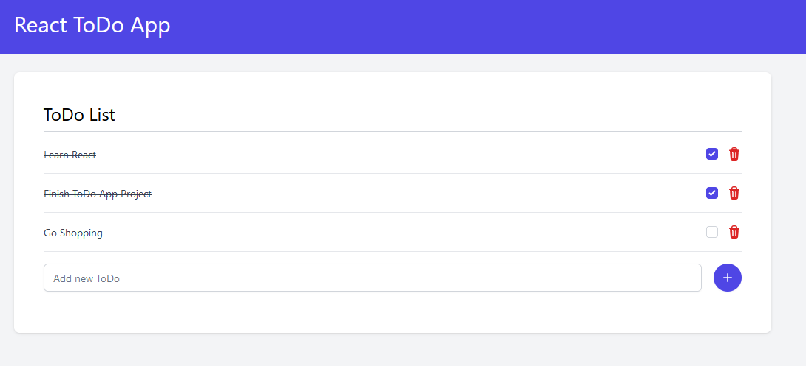

# React ToDo App

A Simple ToDo App in React.

## Quick Start

Run the following commands:

```bash
npm install
npm start
```

This project is built with [Vitejs](https://vitejs.dev/) and [Tailwind](https://tailwindcss.com/).

Screenshot of the app:



See the [online Demo](https://todo-app.tatasadi.com) of frontend without api calls.
